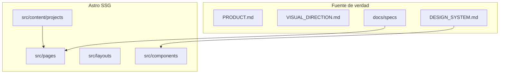

# PLANNING.md — Arquitectura RPV

> **Proyecto:** RPV — web personal de Rubén Palomo Viedma
> **Documento:** Guía de referencia técnica. No generar código de producto sin consultar
> este archivo y una SPEC activa.
> **Empieza por §0.** Si en el futuro hay secciones históricas, §0 prevalece (D-012).

---

## 0. Estado actual (agosto 2026)

**Esta sección prevalece.** SPEC-001 está implementada: Astro SSG + Tailwind v4,
tokens en `global.css`, CI y `vercel.json`. No hay UI comercial aún (SPEC-002+).

### 0.1 Qué hay ahora

| Artefacto | Rol |
|-----------|-----|
| [`AGENTS.md`](AGENTS.md) | Orquestador de agentes |
| [`CLAUDE.md`](CLAUDE.md) | Puntero a AGENTS (D-020) |
| [`docs/PRODUCT.md`](docs/PRODUCT.md) | Producto, oferta, persona |
| [`docs/VISUAL_DIRECTION.md`](docs/VISUAL_DIRECTION.md) | Dirección estética |
| [`docs/DESIGN_SYSTEM.md`](docs/DESIGN_SYSTEM.md) | Tokens y reglas |
| [`docs/DECISIONS.md`](docs/DECISIONS.md) | Decisiones |
| [`docs/specs/`](docs/specs/) | TEMPLATE, BACKLOG, planes |
| [`.cursor/rules/spec-gitflow.mdc`](.cursor/rules/spec-gitflow.mdc) | Flujo git por SPEC |
| `src/assets/images/ruben-source.png` | Maestro del retrato (sin recortar) |
| `public/design/ruben-source.png` | Referencia visual |

### 0.2 Stack objetivo (a instalar en SPEC-001)

| Capa | Tecnología | Notas |
|------|-----------|--------|
| Framework | Astro (estable actual, objetivo 7.x) | SSG |
| Estilos | Tailwind CSS v4 vía `@tailwindcss/vite` | `@theme` en CSS; **sin** `tailwind.config` (D-013) |
| Tipos | TypeScript strict | `astro check` |
| Diagnósticos | `@astrojs/check` | script `npm run check` |
| Contenido | Content collections (Markdown/MDX) | Case studies (D-026); puede entrar en SPEC-001 o 005 |
| Hosting | Vercel (preferido, mismo que Burbujas) o Cloudflare Pages | Decisión de deploy en SPEC-001 / 008 |

No hay librería de animación, 3D, CMS ni React (D-003, D-004). Node **>= 22.12.0**.

### 0.3 Tailwind v4 se configura en CSS

No crear `tailwind.config.mjs`. Tokens en [`src/styles/global.css`](src/styles/global.css)
cuando exista.

### 0.4 Dirección vigente

Producto y diseño viven en `docs/`. Este archivo cubre **arquitectura, estructura y
rendimiento**.

### 0.5 Lo que sigue vigente más abajo

- §2 convenciones de código y árbol de carpetas **objetivo**
- §3 métricas
- §4 roadmap (el detalle operativo está en [`docs/specs/BACKLOG.md`](docs/specs/BACKLOG.md))
- §5 accesibilidad (ampliado en DESIGN_SYSTEM)
- §6 fases post-MVP
- §7 notas para agentes

### 0.6 Verificación (tras SPEC-001)

```bash
npm run check
npm run build
```

No existirá `npm run astro check` (D-028).

### 0.7 Git

Remoto: `https://github.com/Cconkers/rpvai.git` (D-034; antes `Cconkers/rpvai.com`, D-032).
Rama de integración: `develop` (default del repo).

Cuando se inicialice este árbol:

1. `git init` si hace falta, rama `develop`.
2. Añadir `origin` hacia `Cconkers/rpvai` **sin** mezclar el historial Angular
   hasta que el propietario pida el reemplazo (push del nuevo árbol).
3. Una rama `cursor/spec-NNN` por SPEC.
4. Flujo al cerrar: [`.cursor/rules/spec-gitflow.mdc`](.cursor/rules/spec-gitflow.mdc).

No clonar ni copiar `src/app` de Angular aquí.

### 0.8 Oferta vigente (agosto 2026)

Servicios de desarrollo web (frontend, UX/UI, APIs, IA, web con datos), no packs de
landings. Ver D-029 y [`PRODUCT.md`](docs/PRODUCT.md) — Offer.

---

## 1. Arquitectura

Astro renderiza HTML estático en build. JS solo en islas puntuales (nav, revelado),
preferiblemente `<script>` en componentes Astro, no un framework UI.



Content collections para proyectos: un Markdown por case study, plantilla
`src/pages/work/[slug].astro`.

---

## 2. Estructura de carpetas objetivo

```
RPVAI_landing/
├── AGENTS.md
├── CLAUDE.md
├── PLANNING.md
├── astro.config.mjs
├── tsconfig.json
├── package.json
├── public/
│   ├── design/                 # referencias; no UI
│   └── fonts/                  # autoalojadas
├── src/
│   ├── assets/images/          # ruben-source.png → derivados vía astro:assets
│   ├── content/projects/       # collection
│   ├── components/
│   │   ├── ui/
│   │   └── sections/
│   ├── layouts/BaseLayout.astro
│   ├── pages/
│   │   ├── index.astro
│   │   ├── about.astro
│   │   └── work/[slug].astro
│   ├── scripts/                # TS mínimo si hace falta
│   └── styles/global.css
└── docs/
```

### Convenciones

- TypeScript en `src/scripts/`.
- PascalCase componentes Astro; kebab-case IDs y slugs.
- Estado global: ninguno en el MVP. Nav móvil = script local.
- Naming tokens: `--rpv-*` primitivos, `--color-*` semánticos.
- Sin Zustand/Redux. Sin React.

---

## 3. Rendimiento

| Métrica | Objetivo MVP |
|---------|----------------|
| LCP | < 1.5 s |
| CLS | < 0.05 |
| TBT | < 100 ms |
| Lighthouse P/A11y/BP/SEO | ≥ 95 |

Reglas:

- Imágenes: `astro:assets`, dimensiones explícitas, formatos modernos.
- Anima solo `transform` y `opacity`.
- La página es usable sin JS.
- Sin dependencias nuevas (D-004).
- Retrato: no servir el PNG fuente completo a 116 KB+ en cada vista si se puede emitir
  un derivado recortado y redimensionado.

Breakpoints / tiers: mobile ≤768px, tablet ≤1024px, desktop >1024px. Alineados con
Tailwind `md` / `lg` en [`DESIGN_SYSTEM.md`](docs/DESIGN_SYSTEM.md).

---

## 4. Roadmap

El backlog operativo está en [`docs/specs/BACKLOG.md`](docs/specs/BACKLOG.md). Resumen:

| Grupo | SPECs | Qué |
|-------|-------|-----|
| A | (este kit) | Docs + foto fuente. **Hecho en la fundación.** |
| B | 001–003 | Scaffold, chrome, hero+foto |
| C | 004–007 | Servicios, Burbujas, about, contacto |
| D | 008–010 | SEO, legal, polish |
| E | futuras | Demo IA, más proyectos, i18n, Calendly, Resend |

No implementar un grupo posterior sin cerrar (o explicitar skip de) el anterior, salvo
orden distinto pedido por el orquestador.

---

## 5. Accesibilidad

| Requisito | Implementación |
|-----------|----------------|
| Semántica | Landmarks, un `h1`, jerarquía sin saltos |
| Skip link | Primer elemento focusable |
| Teclado | Nav y CTA operables; foco visible |
| Contraste | Tabla normativa DESIGN_SYSTEM |
| Táctil | 44px mínimo |
| Reduced motion | Anular animaciones |
| Retrato | `alt` descriptivo; no `alt=""` |

---

## 6. Post-MVP (Grupo E)

- `/lab` o isla de demo IA (sin hundir Lighthouse)
- Dos proyectos más cuando existan
- i18n EN
- Calendly
- Formulario Resend
- Capturas reales de Burbujas
- Analytics Umami/Plausible (privacidad)

Cada ítem: SPEC + decisión si toca arquitectura.

---

## 7. Notas para el equipo / agentes

- Consultar este documento y `DECISIONS.md` antes de añadir dependencias o carpetas.
- Priorizar simplicidad: HTML + tokens + una collection.
- Cualquier desviación (React, CMS, dark mode) requiere decisión nueva.
- Commits atómicos por SPEC.

---

*Última actualización: agosto 2026*
